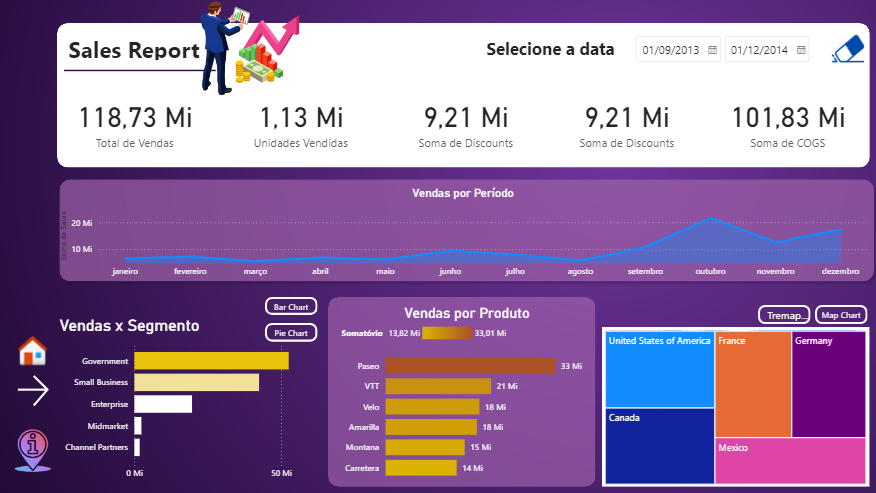
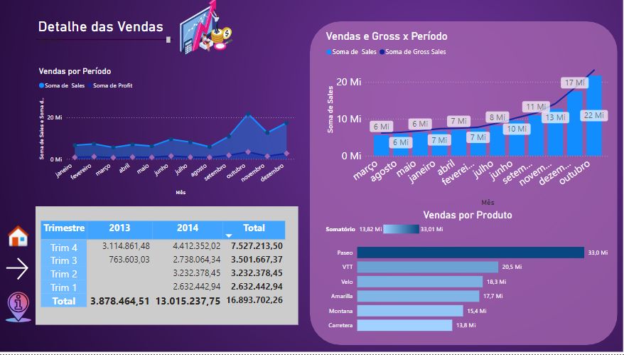
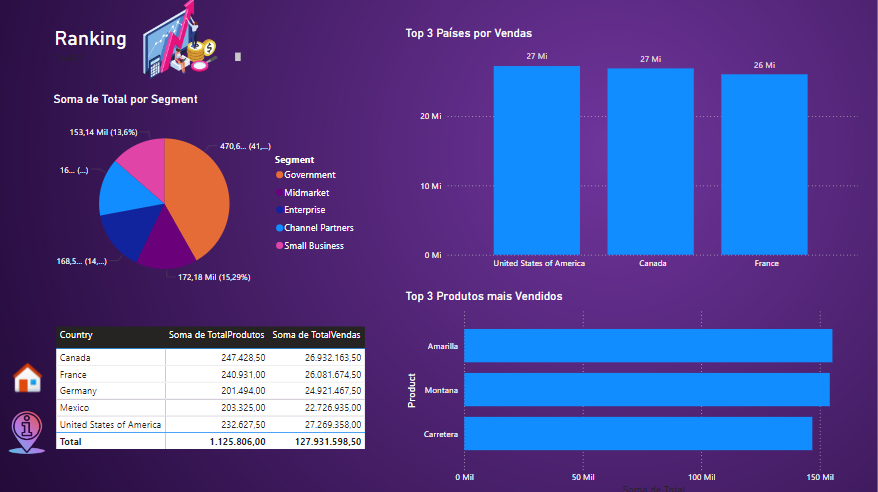

# Desafio Power BI - Módulo 6 DIO - Relatório Vendas e Lucros

No desafio "Criando um Relatório Vendas e Lucros com Data Analytics com Power BI"
do módulo "Data Analytics & Storytelling com Power BI" do Bootcamp "Data Analytics com Power BI" foi alterado o layout de um painel previamente feito em outro módulo. Ao todo foi alterado o layout de 3 relatórios.

Com base num arquivo fornecido onde já existia um relatório, foram criados mais dois relatórios, um relatório de detalhe semelhante ao mostrado na aula e um relátorio livre utilizando os recursos aprendidos em aula. Este relatório livre foi um ranking de alguns indicadores.

Para construir a página de ranking foram utilizadas funções DAX. Agrupamentos foram criados usando a função SUMMARIZE() e o ranking foi feito usando a função TOPN()

Os relatórios ficaram da seguinte forma:

Neste repositório se encontra o arquivo do Power Bi com os relatórios e os arquivos fornecidos pelo curso.
